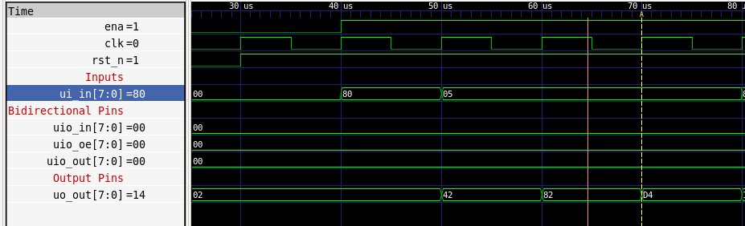
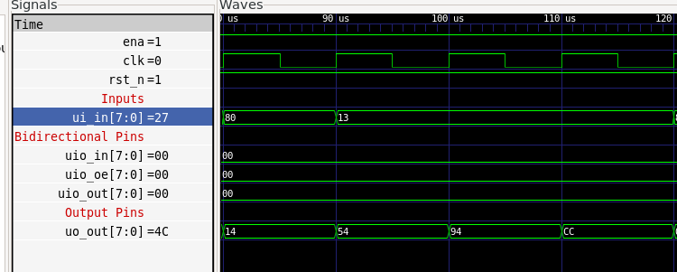
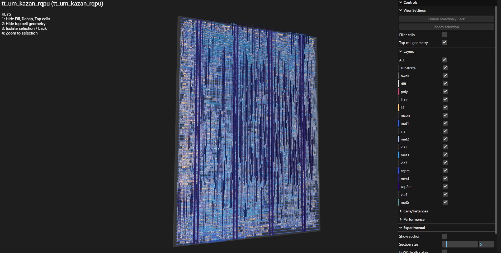

   

# Tiny Tapeout Verilog Project Template

- [Read the documentation for project](docs/info.md)

## What is Tiny Tapeout?

Tiny Tapeout is an educational project that aims to make it easier and cheaper than ever to get your digital and analog designs manufactured on a real chip.

To learn more and get started, visit https://tinytapeout.com.

## Set up your Verilog project

1. Add your Verilog files to the `src` folder.
2. Edit the [info.yaml](info.yaml) and update information about your project, paying special attention to the `source_files` and `top_module` properties. If you are upgrading an existing Tiny Tapeout project, check out our [online info.yaml migration tool](https://tinytapeout.github.io/tt-yaml-upgrade-tool/).
3. Edit [docs/info.md](docs/info.md) and add a description of your project.
4. Adapt the testbench to your design. See [test/README.md](test/README.md) for more information.

The GitHub action will automatically build the ASIC files using [LibreLane](https://www.zerotoasiccourse.com/terminology/librelane/).

## Enable GitHub actions to build the results page

- [Enabling GitHub Pages](https://tinytapeout.com/faq/#my-github-action-is-failing-on-the-pages-part)

## Resources

- [FAQ](https://tinytapeout.com/faq/)
- [Digital design lessons](https://tinytapeout.com/digital_design/)
- [Learn how semiconductors work](https://tinytapeout.com/siliwiz/)
- [Join the community](https://tinytapeout.com/discord)
- [Build your design locally](https://www.tinytapeout.com/guides/local-hardening/)

## What next?

- [Submit your design to the next shuttle](https://app.tinytapeout.com/).
- Edit [this README](README.md) and explain your design, how it works, and how to test it.
- Share your project on your social network of choice:
  - LinkedIn [#tinytapeout](https://www.linkedin.com/search/results/content/?keywords=%23tinytapeout) [@TinyTapeout](https://www.linkedin.com/company/100708654/)
  - Mastodon [#tinytapeout](https://chaos.social/tags/tinytapeout) [@matthewvenn](https://chaos.social/@matthewvenn)
  - X (formerly Twitter) [#tinytapeout](https://twitter.com/hashtag/tinytapeout) [@tinytapeout](https://twitter.com/tinytapeout)
  - Bluesky [@tinytapeout.com](https://bsky.app/profile/tinytapeout.com)







# tt_um_kazan_rqpu

> A 4-bit host-driven execution core with reversible-inspired state undo, built for [Tiny Tapeout](https://tinytapeout.com) on the SKY130A PDK.

---

## Quick Summary

<!-- PICTURE SUGGESTION: A clean block diagram here showing the 4-phase cycle as a loop:
     P0 (Instruction) → P1 (Operand) → P2 (Execute) → P3 (Output) → back to P0.
     Annotate each phase with what goes on ui_in and what comes out uo_out. -->

This is **not** a classical CPU. It has no program counter and fetches no instructions on its own. Instead, an external host (microcontroller, FPGA, RP2040 on a TT board) drives it one operation at a time over a strict 4-phase protocol:

| Phase | Host does | Core does |
|---|---|---|
| `00` | Drive instruction byte on `ui_in` | Latches `class`, `mode`, `func` |
| `01` | Drive operand byte on `ui_in` | Latches `A`, `B` |
| `10` | Hold | Executes and commits state |
| `11` | Sample `uo_out` | Result and flags are valid |

**8 instruction classes** cover arithmetic, bit permutations, comparisons, memory, register-file ops, and — the standout feature — a full **save/reverse snapshot mechanism** inspired by reversible computing.

<!-- PICTURE SUGGESTION: A pin diagram showing ui_in[7:0] split into its phase-00 fields
     (class[2:0] | mode | func[3:0]) and phase-01 fields (A[3:0] | B[3:0]),
     alongside uo_out[7:0] split into (phase[1:0] | data[3:0] | Z | C). -->

**Output encoding:**
```
uo_out[7:6] = current phase
uo_out[5:2] = result nibble
uo_out[1]   = Z flag
uo_out[0]   = C flag
```

### Key design tradeoffs

- **Host-sequenced, not self-fetching** — gives maximum flexibility to the controller at the cost of requiring external sequencing logic.
- **4-bit datapath** — fits comfortably in a 1×2 Tiny Tapeout tile; not suitable for general-purpose computation.
- **Reversible-inspired, not strictly reversible** — the save/reverse snapshot is a pragmatic full-state undo, not a gate-level Toffoli/Fredkin implementation. Irreversible ops like ADD and SHL coexist with the undo mechanism.
- **No external hardware needed** — `uio` pins are unused; you only need `ui_in`, `uo_out`, `clk`, and `rst_n`.

### Instruction classes at a glance

| Class | What it does |
|---|---|
| `CLS_ALU` | ADD, SUB, AND, OR, XOR, NOT, INC, DEC, … |
| `CLS_PERM` | ROL, ROR, SHL, SHR, BITREV, GRAYENC, GRAYDEC, ECC |
| `CLS_CMP` | Compare, MIN, MAX, POPCOUNT, ZERO? |
| `CLS_MEM` | Read/write 4-word RAM or 16-entry system-register space |
| `CLS_SYS` | Load immediate, MOV, SWAP, CLEAR on any system register |
| `CLS_REV` | **SAVE** (snapshot), **REVERSE** (undo), register swaps, parity |
| `CLS_RFALU` | Arithmetic and logic on the 4-entry register file |
| `CLS_RFIO` | Load, move, swap, transfer between RF and ACC/BREG |

### Quick start (host pseudocode)

```python
# 1. Reset the core
# 2. Wait for phase 00 on uo_out[7:6]
# 3. Drive instruction byte on ui_in, clock once
# 4. Drive operand byte on ui_in, clock once
# 5. Clock once (execute)
# 6. Sample uo_out while phase == 11, clock once
# 7. Back to phase 00 — repeat
```

For more detail, see [ARCHITECTURE.md](ARCHITECTURE.md).

---

---

# ARCHITECTURE.md (Detailed Reference)

## 1. Tiny Tapeout interface

```verilog
module tt_um_kazan_rqpu (
    input  wire [7:0] ui_in,   // instruction byte / operand byte (phase-dependent)
    output wire [7:0] uo_out,  // phase + result nibble + Z + C
    input  wire [7:0] uio_in,  // unused
    output wire [7:0] uio_out, // always 0
    output wire [7:0] uio_oe,  // always 0 (all bidir pins stay inputs)
    input  wire       ena,
    input  wire       clk,
    input  wire       rst_n    // active-low reset
);
```

The bidirectional bank is fully unused. No PMOD required.

---

## 2. Four-phase protocol in detail

<!-- PICTURE SUGGESTION: A waveform diagram (like a timing diagram) showing clk,
     rst_n, ui_in, and uo_out[7:6] (phase) across 5 clock cycles for one instruction.
     Mark each clock edge with its phase label. -->

One instruction always takes exactly four clock edges:

```
Clock:   ___↑___↑___↑___↑___
Phase:    00  01  10  11  (→ back to 00)
ui_in:   [INSTR][OPER][hold][hold]
uo_out:  [...  ][... ][... ][RESULT]
```

The host must:
1. Present the instruction byte **before** the rising edge that samples P0.
2. Present the operand byte **before** the rising edge that samples P1.
3. Sample the result **after** the rising edge of P3 (phase `11` on `uo_out[7:6]`).

`ena = 0` freezes the phase counter; the core holds all state.

---

## 3. Instruction encoding

### Phase 00 — instruction byte

```
ui_in[7:5] = class  (3 bits, selects one of 8 operation families)
ui_in[4]   = mode   (meaning depends on class)
ui_in[3:0] = func   (selects specific operation within the class)
```

### Phase 01 — operand byte

```
ui_in[7:4] = A  (source address / register index / upper nibble)
ui_in[3:0] = B  (immediate value / lower nibble / destination)
```

---

## 4. Architectural state

The core holds:

**Working registers (4-bit each):** `ACC`, `BREG`, `SHD`, `MAR`, `MDR`, `OUT`, `TMP0`, `TMP1`, `EXT0`, `EXT1`

**Status flags:** `Z` (zero), `C` (carry / no-borrow / GT), `N` (negative — internal only, not exported on pins)

**Small memories:**
- `RAM[0:3]` — 4 × 4-bit general scratchpad
- `RF[0:3]` — 4 × 4-bit register file

**Snapshot state:** A full mirror of every register above (`prev_*`) plus `undo_valid`. Used by `CLS_REV`.

---

## 5. System-register address space

`CLS_MEM` (mode=1) and `CLS_SYS` access a 16-entry mapped space:

| Addr | Name | Contents |
|---:|---|---|
| `0x0` | `SYS_ACC` | Accumulator |
| `0x1` | `SYS_BREG` | B register |
| `0x2` | `SYS_SHD` | Shadow register |
| `0x3` | `SYS_FLAGS` | `{undo_valid, N, C, Z}` |
| `0x4` | `SYS_MAR` | Memory address register |
| `0x5` | `SYS_MDR` | Memory data register |
| `0x6` | `SYS_OUT` | Output/result register |
| `0x7` | `SYS_PHS` | `{phase[1:0], busy, valid}` (read-only) |
| `0x8–0xB` | `TMP0/1`, `EXT0/1` | Scratch registers |
| `0xC–0xF` | `RF0–RF3` | Register file mirrors |

Writing `SYS_FLAGS` updates only `N`, `C`, `Z` — it cannot directly set `undo_valid`.

---

## 6. Instruction classes — operation reference

### CLS_ALU `000` — Accumulator arithmetic and logic

`mode=0`: `rhs = B` (immediate)  
`mode=1`: `rhs = sys[A]`

| func | Op | Effect |
|---:|---|---|
| `0x0` | ADD | `ACC = ACC + rhs`, updates Z/N/C |
| `0x1` | ADC | `ACC = ACC + rhs + C` |
| `0x2` | SUB | `ACC = ACC - rhs`, C = no-borrow |
| `0x3` | SBC | `ACC = ACC - rhs - ~C` |
| `0x4` | AND | `ACC = ACC & rhs` |
| `0x5` | OR | `ACC = ACC \| rhs` |
| `0x6` | XOR | `ACC = ACC ^ rhs` |
| `0x7` | XNOR | `ACC = ~(ACC ^ rhs)` |
| `0x8` | NAND | `ACC = ~(ACC & rhs)` |
| `0x9` | NOR | `ACC = ~(ACC \| rhs)` |
| `0xA` | NOT | `ACC = ~ACC` |
| `0xB` | BIC | `ACC = ACC & ~rhs` |
| `0xC` | PASS | `ACC = rhs` |
| `0xD` | INC | `ACC = ACC + 1` |
| `0xE` | DEC | `ACC = ACC - 1` |

Every `CLS_ALU` op snapshots state first.

---

### CLS_PERM `001` — Shift, rotate, permute, Gray, ECC

`mode=0`: source = `ACC`  
`mode=1`: source = `sys[A]`

Result is written back to `ACC` and `out_q`.

| func | Op | Notes |
|---:|---|---|
| `0x0` | ROL | rotate left |
| `0x1` | ROR | rotate right |
| `0x2` | SHL | shift left, C = evicted bit |
| `0x3` | SHR | shift right |
| `0x4` | SWAP2 | swap upper and lower 2-bit halves |
| `0x5` | BITREV | reverse bit order |
| `0x6` | GRAYENC | binary → Gray |
| `0x7` | GRAYDEC | Gray → binary |
| `0x8` | ASR | arithmetic shift right |
| `0x9` | ECC | compact Hamming-style parity nibble, written to ACC |

ROL/ROR/SWAP2/BITREV/GRAYENC/GRAYDEC are all bijective (reversible). SHL/SHR/ASR are not.

---

### CLS_CMP `010` — Compare and reduction

`mode=0`: compare full 4-bit `ACC` against immediate `B`  
`mode=1`: compare lower 3 bits of `ACC` against lower 3 bits of `sys[A]` (3-bit comparator mode)

Does **not** overwrite `ACC`.

| func | Op | Output |
|---:|---|---|
| `0x0` | CMP | `{0, GT, EQ, LT}` |
| `0x1` | EQ | `0001` if equal |
| `0x2` | GT | `0001` if greater |
| `0x3` | LT | `0001` if less |
| `0x4` | MIN | minimum of the two operands |
| `0x5` | MAX | maximum of the two operands |
| `0x6` | POPCOUNT | count of set bits in `ACC` |
| `0x7` | ZERO? | `0001` if `ACC == 0` |

---

### CLS_MEM `011` — Memory and system-space access

`mode=0`: target is `RAM[A[1:0]]`  
`mode=1`: target is `sys[A]`

| func | Op | Effect |
|---:|---|---|
| `0x0` | READ | `MDR = mem[A]`, result to `out_q` |
| `0x1` | WRITE | `mem[A] = B` |
| `0x2` | LOADACC | `ACC = MDR = mem[A]` |
| `0x3` | SWAPACC | `ACC ↔ mem[A]` |

---

### CLS_SYS `100` — System register operations

Only `func[1:0]` is decoded — function codes `0x0`, `0x4`, `0x8`, `0xC` all behave identically as `LOADIMM`, and similarly for the others.

| `func[1:0]` | Op | Effect |
|---:|---|---|
| `00` | LOADIMM | `sys[A] = B` |
| `01` | MOV | `sys[A] = sys[B]` |
| `10` | SWAP | `sys[A] ↔ sys[B]` |
| `11` | CLEAR | `sys[A] = 0` |

This is the primary way to initialize `ACC`, `BREG`, temp registers, and so on.

---

### CLS_REV `101` — Reversible-inspired save / reverse

<!-- PICTURE SUGGESTION: A "before/after" diagram showing the snapshot mechanism:
     Left side = "current state" box with ACC/BREG/SHD/RAM/RF/flags.
     SAVE draws an arrow copying it to a "prev state" box on the right.
     REVERSE draws a double-headed arrow swapping both boxes. -->

The standout class. `SAVE` takes a **full snapshot** of every register, every RAM word, every RF entry, and all flags into `prev_*`. `REVERSE` **swaps** current and previous state, so you can bounce back and forth between two complete machine images.

| func | Op | Effect |
|---:|---|---|
| `0x0` | SAVE | Snapshot all state into `prev_*`; sets `undo_valid` |
| `0x1` | REVERSE | If `undo_valid`: swap current ↔ previous (full machine swap) |
| `0x2` | ACC ↔ SHD | Swap accumulator and shadow register |
| `0x3` | ACC ↔ BREG | Swap accumulator and B register |
| `0x4` | CLEARUNDO | Clear `undo_valid` (discard snapshot) |
| `0x5` | PARITY/ECC | `out_q = ecc4(ACC)` without overwriting `ACC` |

Note: `func=0x5` here differs from `CLS_PERM func=0x9` — the PERM version writes the ECC result back into `ACC`; the REV version only probes it through `out_q`.

---

### CLS_RFALU `110` — Register-file ALU

Operand encoding: `A[3:2]` = `rs`, `A[1:0]` = `rt`, `B[3:2]` = `rd`

`RF[rd] = RF[rs] op RF[rt]`

| func | Op |
|---:|---|
| `0x0` | ADD |
| `0x1` | XOR |
| `0x2` | AND |
| `0x3` | OR |
| `0x4` | SUB |
| `0x5` | XNOR |
| `0x6` | NAND |
| `0x7` | NOR |

Does not modify `ACC`.

---

### CLS_RFIO `111` — Register-file utilities

| func | Op | Effect |
|---:|---|---|
| `0x0` | RFLOADI | `RF[A[1:0]] = B` |
| `0x1` | RFREAD | `out_q = RF[A[1:0]]` |
| `0x2` | RFTOACC | `ACC = RF[A[1:0]]` |
| `0x3` | ACCTORF | `RF[A[1:0]] = ACC` |
| `0x4` | RFMOVE | `RF[dst] = RF[src]`, `A[3:2]`=src, `A[1:0]`=dst |
| `0x5` | RFSWAP | `RF[A[3:2]] ↔ RF[A[1:0]]` |
| `0x6` | RFTOBREG | `BREG = RF[A[1:0]]` |
| `0x7` | BREGTORF | `RF[A[1:0]] = BREG` |

---

## 7. Worked examples

### Load 6 into ACC, then add 3

```
Phase 00: ui_in = {CLS_SYS, 0, 0x0}   → LOADIMM
Phase 01: ui_in = {SYS_ACC, 0x6}
Phase 11: uo_out → data = 0x6, Z=0, C=0

Phase 00: ui_in = {CLS_ALU, 0, 0x0}   → ADD immediate
Phase 01: ui_in = {0x0, 0x3}           → A=0 (unused), B=3
Phase 11: uo_out → data = 0x9, Z=0, C=0
```

### Save state, mutate, then reverse

```
1. SYS LOADIMM ACC = 4
2. SYS LOADIMM BREG = A
3. REV ACC ↔ BREG         → ACC becomes A, BREG becomes 4; state snapshot saved
4. REV REVERSE             → full machine swap: ACC returns to 4, BREG returns to A
```

---

## 8. Testing

### Run RTL simulation

```bash
cd test
make -B
```

### Run gate-level simulation

```bash
make -B GATES=yes
```

Waveforms are written to `tb.fst`. View with GTKWave (`gtkwave tb.fst tb.gtkw`) or Surfer (`surfer tb.fst`).

### What the current testbench covers

The `test/test.py` cocotb suite exercises: reset behavior, SYS LOADIMM, ALU ADD/SUB/XOR, PERM SHL/BITREV, CMP compare, MEM RAM write/read, system-space read via MEM mode=1, REV ACC↔BREG, REV REVERSE, and REV parity/ECC.

### What is not yet covered

All RFALU and RFIO opcodes, full ALU opcode sweep, CMP MIN/MAX/POPCOUNT, MEM LOADACC/SWAPACC, REV ACC↔SHD / SAVE / CLEARUNDO, flag persistence across multiple instructions, and corner cases around carry-borrow behavior.

---

## 9. Known issues and gotchas

- `N` flag is **not exported on `uo_out`** — read it through `SYS_FLAGS` via `CLS_MEM mode=1`.
- `CLS_SYS` only decodes `func[1:0]` — function codes `0x0` through `0xF` collapse into four actual operations.
- `CLS_REV func=0x1` (REVERSE) is a **swap**, not a restore. Issuing it twice returns you to the original state.
- Two helper tasks (`flags_from_result`, `clear_all_current`) exist in the RTL but are not called by any live instruction path — scaffolding for future extensions.


# tt_um_kazan_rqpu

## 4-bit externally driven execution core with reversible-undo support


At a high level, `tt_um_kazan_rqpu` is **not** a stored-program microprocessor with a program counter and external memory protocol. Instead, it is a **Tiny Tapeout-compatible 4-bit execution core** that is driven directly by an external host over the standard Tiny Tapeout pins:

- one byte of **instruction** is presented on `ui_in`
- one byte of **operands/data** is presented on `ui_in` on the next phase
- the core executes internally
- the result and selected flags appear on `uo_out`

The design combines:

- a 4-bit ALU
- a permutation / shifter / Gray-code / ECC block
- a compare / reduce block
- a small memory and system-register space
- a reversible-inspired **SAVE / REVERSE** mechanism based on a full-state snapshot
- a 4-entry register file with both direct I/O and register-file ALU operations

So the best description is:

> **a custom, clocked, host-sequenced 4-bit execution engine with reversible-inspired state undo and several reversible-style transforms**.

---

## 1. What this design is, and what it is not

### What it is

- A Tiny Tapeout top-level module named `tt_um_kazan_rqpu`
- A **4-phase sequential datapath**
- A **4-bit internal state machine** with arithmetic, logic, compare, memory, and reversible-style operations
- A design that fits naturally into the Tiny Tapeout wrapper model

### What it is not

- Not a standalone CPU with instruction fetch and decode from ROM
- Not a strict Toffoli/Fredkin-only reversible circuit
- Not a logic-locked design

This distinction matters. The attached reversible-computing PDFs define strict reversibility as a one-to-one input/output mapping with no information loss. This RTL includes **reversible-inspired features**, but the whole machine is **not globally reversible**, because it also implements destructive operations such as add, subtract, clear, load-immediate, shift-left/right, and memory write.

---

## 2. Tiny Tapeout interface

The module uses the standard Tiny Tapeout top-level shape:

```verilog
module tt_um_kazan_rqpu (
    input  wire [7:0] ui_in,
    output wire [7:0] uo_out,
    input  wire [7:0] uio_in,
    output wire [7:0] uio_out,
    output wire [7:0] uio_oe,
    input  wire       ena,
    input  wire       clk,
    input  wire       rst_n
);
```

### Pin usage summary

| Signal | Direction | Width | Meaning |
|---|---:|---:|---|
| `ui_in` | input | 8 | Multiplexed instruction byte or operand byte depending on phase |
| `uo_out` | output | 8 | Phase, result nibble, and selected status flags |
| `uio_in` | input | 8 | Unused |
| `uio_out` | output | 8 | Always zero |
| `uio_oe` | output | 8 | Always zero, so all bidirectional pins stay inputs |
| `ena` | input | 1 | Execution enable; when low the core holds state |
| `clk` | input | 1 | Main clock |
| `rst_n` | input | 1 | Active-low reset |

### Public output encoding

`uo_out` is encoded as:

| Bits | Meaning |
|---|---|
| `uo_out[7:6]` | current phase |
| `uo_out[5:2]` | result/output nibble (`out_q`) |
| `uo_out[1]` | zero flag `Z` |
| `uo_out[0]` | carry / compare flag `C` |

The negative flag `N` and the undo-valid flag are **not directly exported** on pins, but they can be read through the internal system-register space.

### Bidirectional pins

This core does **not** use the bidirectional I/O bank.

```verilog
assign uio_out = 8'h00;
assign uio_oe  = 8'h00;
```

That means there is no required PMOD, no external bus on `uio`, and no direction-control complexity.

---

## 3. Functional description

## 3.1 Four-phase execution protocol

The entire core is organized around a 4-phase external transaction protocol:

| Phase code | Name | What the host does | What the core does |
|---|---|---|---|
| `00` | `P0_INSTR` | Drive instruction byte on `ui_in` | Latch `{class, mode, func}` |
| `01` | `P1_OPERAND` | Drive operand/data byte on `ui_in` | Latch `{A, B}` |
| `10` | `P2_EXECUTE` | Keep inputs stable | Execute selected operation and commit state |
| `11` | `P3_OUTPUT` | Sample output | Result/flags are valid on `uo_out` |

So one host-issued operation takes **four clock phases**.

### Instruction byte format

During `P0_INSTR`, the host drives:

```text
ui_in[7:5] = class
ui_in[4]   = mode
ui_in[3:0] = func
```

### Operand byte format

During `P1_OPERAND`, the host drives:

```text
ui_in[7:4] = A
ui_in[3:0] = B
```

### Important system-level implication

This is an **externally sequenced core**. It does not fetch instructions by itself. Some external controller must:

1. wait for phase `00`
2. place an instruction byte on `ui_in`
3. advance the clock
4. place an operand byte on `ui_in`
5. advance the clock until phase `11`
6. sample the result

That makes the design much more like a **coprocessor / execution unit** than a classical CPU.

---

## 4. Internal architecture

A useful block-level view is:

```text
                  +-----------------------------+
ui_in ----------> | phase / instruction latches |
clk,rst_n,ena --> | P0: class/mode/func         |
                  | P1: arg_a / arg_b           |
                  +-------------+---------------+
                                |
                                v
                  +-----------------------------+
                  | execution-class decoder      |
                  |                             |
                  |  CLS_ALU    arithmetic      |
                  |  CLS_PERM   shifter/permute |
                  |  CLS_CMP    compare/reduce  |
                  |  CLS_MEM    RAM/system      |
                  |  CLS_SYS    sys register op |
                  |  CLS_REV    save/reverse    |
                  |  CLS_RFALU  register ALU    |
                  |  CLS_RFIO   register I/O    |
                  +-------------+---------------+
                                |
                                v
                  +-----------------------------+
                  | architectural state         |
                  | ACC, BREG, SHD             |
                  | MAR, MDR, OUT              |
                  | TMP0, TMP1, EXT0, EXT1     |
                  | Z, C, N, undo_valid        |
                  | RAM[4], RF[4]              |
                  | PREV_* snapshot state       |
                  +-------------+---------------+
                                |
                                v
                           uo_out[7:0]
```

## 4.1 Main architectural state

The core keeps the following main current-state registers:

- `acc_q` – accumulator / primary ALU operand
- `breg_q` – secondary general-purpose working register
- `shd_q` – shadow / auxiliary register
- `mar_q` – 4-bit memory address register placeholder
- `mdr_q` – 4-bit memory data register placeholder
- `out_q` – 4-bit public result register
- `tmp0_q`, `tmp1_q` – scratch registers
- `ext0_q`, `ext1_q` – extra extension registers
- `z_q`, `c_q`, `n_q` – status flags
- `undo_valid_q` – whether a previous snapshot exists

It also keeps mirrored **previous-state copies**:

- `prev_acc_q`, `prev_breg_q`, `prev_shd_q`, ...
- `prev_z_q`, `prev_c_q`, `prev_n_q`, `prev_undo_valid_q`
- `prev_ram_q[0:3]`
- `prev_rf_q[0:3]`

These previous-state registers enable the reversible-style **SAVE / REVERSE** behavior.

## 4.2 Small memories

The core contains two very small internal memories:

| Memory | Size | Purpose |
|---|---:|---|
| `ram_q[0:3]` | 4 x 4-bit | tiny general memory |
| `rf_q[0:3]`  | 4 x 4-bit | 4-entry register file |


## 4.3 Helper transforms

The RTL defines helper functions for:

- `bitrev4(x)` – bit reversal
- `swap2_4(x)` – swap upper and lower 2-bit halves
- `grayenc4(x)` – binary to Gray conversion
- `graydec4(g)` – Gray to binary conversion
- `ecc4(x)` – compact parity / Hamming-style nibble `{p4,p2,p1,p0}`
- `rf_read(idx)` – register file read helper
- `sys_read(addr)` – system-space read helper
- `mem_read(mode, addr)` – read either RAM or system space depending on `mode`

---

## 5. System-space map

The core exposes many of its internal registers through a 16-entry system-register address space.

| Addr | Name | Meaning |
|---:|---|---|
| `0x0` | `SYS_ACC` | accumulator |
| `0x1` | `SYS_BREG` | B register |
| `0x2` | `SYS_SHD` | shadow register |
| `0x3` | `SYS_FLAGS` | `{undo_valid, N, C, Z}` |
| `0x4` | `SYS_MAR` | memory address register placeholder |
| `0x5` | `SYS_MDR` | memory data register |
| `0x6` | `SYS_OUT` | result/output register |
| `0x7` | `SYS_PHS` | `{phase[1:0], busy, valid}` |
| `0x8` | `SYS_TMP0` | temp register 0 |
| `0x9` | `SYS_TMP1` | temp register 1 |
| `0xA` | `SYS_EXT0` | extension register 0 |
| `0xB` | `SYS_EXT1` | extension register 1 |
| `0xC` | `SYS_RF0` | RF entry 0 mirror |
| `0xD` | `SYS_RF1` | RF entry 1 mirror |
| `0xE` | `SYS_RF2` | RF entry 2 mirror |
| `0xF` | `SYS_RF3` | RF entry 3 mirror |

### Notes

- `SYS_FLAGS` is readable as `{undo_valid, N, C, Z}`.
- Writing `SYS_FLAGS` only updates `N`, `C`, and `Z`; it does **not** directly set `undo_valid`.
- `SYS_PHS` is read-only from the standpoint of `sys_write`.
- The system map also provides an alternate way to observe RF contents.

---

## 6. Execution pipeline in detail

## 6.1 Phase 0 — instruction latch

When the phase is `00`, the core captures:

- `ir_class_q <= ui_in[7:5]`
- `ir_mode_q  <= ui_in[4]`
- `ir_func_q  <= ui_in[3:0]`

Then it advances to `01`.

## 6.2 Phase 1 — operand latch

When the phase is `01`, the core captures:

- `arg_a_q <= ui_in[7:4]`
- `arg_b_q <= ui_in[3:0]`

Then it advances to `10`.

## 6.3 Phase 2 — execute / commit

When the phase is `10`, the selected class block runs and updates:

- architectural registers
- small RAM or RF entries
- status flags
- output register `out_q`
- snapshot state when appropriate

Then it advances to `11`.

## 6.4 Phase 3 — output valid

When the phase is `11`, the result is externally visible on `uo_out` and the machine then returns to phase `00` on the next active clock edge.

### Practical observation

Even though `uo_out` is always driven, the **new** result of the just-issued instruction should be treated as valid in `P3_OUTPUT`.

---

## 7. Instruction classes and operation set

The top 3 instruction bits select one of eight classes.

| Class | Bits | Name | Role |
|---|---|---|---|
| `CLS_ALU` | `000` | Arithmetic / boolean | accumulator-based arithmetic and logic |
| `CLS_PERM` | `001` | Permute / shift / Gray / ECC | bit permutations and encoding |
| `CLS_CMP` | `010` | Compare / reduce | compare, min/max, popcount |
| `CLS_MEM` | `011` | Memory / system access | RAM and system-space read/write/swap |
| `CLS_SYS` | `100` | System ops | register load/move/swap/clear |
| `CLS_REV` | `101` | Reversible-inspired ops | save, reverse, swaps, parity/ECC |
| `CLS_RFALU` | `110` | Register-file ALU | RF arithmetic / logic |
| `CLS_RFIO` | `111` | Register-file utilities | RF load/read/move/swap/transfers |

---

## 7.1 `CLS_ALU` — accumulator arithmetic and boolean logic

### Mode meaning

For this class:

- `mode = 0` → use `B` as an immediate nibble
- `mode = 1` → use `sys_read(A)` as the right-hand operand

So the effective right-hand-side operand is:

```text
rhs = (mode == 1) ? sys[A] : B
```

### Operations

| Func | Operation | Effect |
|---:|---|---|
| `0x0` | `ADD` | `ACC = ACC + rhs` |
| `0x1` | `ADC` | `ACC = ACC + rhs + C` |
| `0x2` | `SUB` | `ACC = ACC - rhs` |
| `0x3` | `SBC` | `ACC = ACC - rhs - ~C` |
| `0x4` | `AND` | `ACC = ACC & rhs` |
| `0x5` | `OR` | `ACC = ACC | rhs` |
| `0x6` | `XOR` | `ACC = ACC ^ rhs` |
| `0x7` | `XNOR` | `ACC = ~(ACC ^ rhs)` |
| `0x8` | `NAND` | `ACC = ~(ACC & rhs)` |
| `0x9` | `NOR` | `ACC = ~(ACC | rhs)` |
| `0xA` | `NOT` | `ACC = ~ACC` |
| `0xB` | `BIC` | `ACC = ACC & ~rhs` |
| `0xC` | `PASS` | `ACC = rhs` |
| `0xD` | `INC` | `ACC = ACC + 1` |
| `0xE` | `DEC` | `ACC = ACC - 1` |
| other | pass-through | `out_q` keeps `ACC` |

### Flags

For arithmetic:

- `Z` is set when the result is zero
- `N` is the result MSB
- `C` is carry-out for add / add-with-carry
- for subtract forms, `C` is used as a **no-borrow** indicator (`1` means no borrow)

---

## 7.2 `CLS_PERM` — permutation, shift, Gray, and ECC

### Mode meaning

For this class:

- `mode = 0` → source is `ACC`
- `mode = 1` → source is `sys_read(A)`

### Operations

| Func | Operation | Description |
|---:|---|---|
| `0x0` | `ROL` | rotate left |
| `0x1` | `ROR` | rotate right |
| `0x2` | `SHL` | logical shift left |
| `0x3` | `SHR` | logical shift right |
| `0x4` | `SWAP2` | swap upper and lower 2-bit halves |
| `0x5` | `BITREV` | reverse bit order |
| `0x6` | `GRAYENC` | binary to Gray |
| `0x7` | `GRAYDEC` | Gray to binary |
| `0x8` | `ASR` | arithmetic shift right |
| `0x9` | `ECC` | compact parity/Hamming-style nibble |
| other | pass-through | `res = src` |

### State update

Unlike compare-only logic, this class **writes the result back into `ACC`** and also into `out_q`.

### Important nuance

Some of these operations are reversible or bijective:

- `ROL`, `ROR`, `SWAP2`, `BITREV`, `GRAYENC`, `GRAYDEC`

Some are not:

- `SHL`, `SHR`, `ASR`

So this class mixes reversible-style transformations with conventional irreversible shifts.

---

## 7.3 `CLS_CMP` — compare and reduction

### Mode meaning

This class has an unusual and important behavior:

- `mode = 0` → compare full 4-bit `ACC` against immediate `B`
- `mode = 1` → compare only the **lower 3 bits** of `ACC` against the lower 3 bits of `sys_read(A)`

That means `mode = 1` behaves a lot like a **3-bit comparator mode**, which aligns well with the comparator emphasis in the reversible-project recommendations.

### Operations

| Func | Operation | Output |
|---:|---|---|
| `0x0` | compare nibble | `{0, GT, EQ, LT}` |
| `0x1` | `EQ` | `0001` if equal |
| `0x2` | `GT` | `0001` if greater |
| `0x3` | `LT` | `0001` if less |
| `0x4` | `MIN` | minimum of operands |
| `0x5` | `MAX` | maximum of operands |
| `0x6` | `POPCOUNT` | number of ones in `ACC` |
| `0x7` | `ZERO?` | `0001` if `ACC == 0` |
| other | compare nibble | `{0, GT, EQ, LT}` |

### State update

This class updates:

- `out_q`
- `N`
- `C = GT`
- `Z = EQ`

It does **not** overwrite `ACC`.

---

## 7.4 `CLS_MEM` — RAM and system-space access

### Mode meaning

For this class:

- `mode = 0` → access internal 4-word RAM using `A[1:0]`
- `mode = 1` → access the 16-entry system space using `A`

### Operations

| Func | Operation | Meaning |
|---:|---|---|
| `0x0` | `READ` | read selected location into `MDR` and `out_q` |
| `0x1` | `WRITE` | write `B` into selected RAM/system location |
| `0x2` | `LOADACC` | load selected location into `ACC`, `MDR`, and `out_q` |
| `0x3` | `SWAPACC` | swap `ACC` with RAM/system location |
| other | hold | leave `out_q` unchanged |

### Why this class matters

This class makes the machine more than a bare ALU. It gives the host a tiny scratch memory plus a way to inspect and manipulate the whole internal system state.

---

## 7.5 `CLS_SYS` — generic system-register operations

This class performs direct operations on system-space registers.

### Important decoding quirk

Only `func[1:0]` is used. That means the 16 possible function values collapse into **four real operations**:

| `func[1:0]` | Meaning |
|---:|---|
| `00` | `LOADIMM` |
| `01` | `MOV` |
| `10` | `SWAP` |
| `11` | `CLEAR` |

So, for example, `0x0`, `0x4`, `0x8`, and `0xC` all behave like `LOADIMM` in this class.

### Operations

| Effective func | Operation | Meaning |
|---|---|---|
| `LOADIMM` | `sys[A] = B` | write immediate nibble into system register |
| `MOV` | `sys[A] = sys[B]` | copy one system register to another |
| `SWAP` | `sys[A] <-> sys[B]` | swap two system registers |
| `CLEAR` | `sys[A] = 0` | clear one system register |

### Use cases

This is the easiest way to:

- initialize `ACC`, `BREG`, `SHD`, temp registers, etc.
- move values between architectural registers
- clear state
- access RF mirrors through `SYS_RF0`–`SYS_RF3`

---

## 7.6 `CLS_REV` — reversible-inspired save / reverse / swaps

This is the most distinctive part of the design.

### Operations

| Func | Operation | Meaning |
|---:|---|---|
| `0x0` | `SAVE` | snapshot current machine state into `prev_*` |
| `0x1` | `REVERSE` | exchange current state with previous snapshot if valid |
| `0x2` | `ACC <-> SHD` | swap accumulator and shadow register |
| `0x3` | `ACC <-> BREG` | swap accumulator and B register |
| `0x4` | `CLEARUNDO` | clear `undo_valid` |
| `0x5` | `PARITY/ECC` | output `ecc4(ACC)` without overwriting `ACC` |
| other | hold | leave `out_q` unchanged |

### How SAVE/REVERSE actually works

`snapshot_current_to_prev()` copies:

- all architectural registers
- all three exposed flags plus `undo_valid`
- the 4-word RAM
- the 4-entry register file

into the `prev_*` shadow state.

`reverse_swap_all()` then **swaps** current and previous state, rather than merely restoring it. That is stronger than a normal undo because it lets the machine bounce between two full snapshots.

### Why this is only “reversible-inspired”

This is an excellent undo mechanism, but it is **not the same thing as strict gate-level reversible computing**. The machine can still execute irreversible operations; this class simply preserves enough old state to reverse one full machine snapshot.

---

## 7.7 `CLS_RFALU` — register-file ALU

This class performs ALU-like operations directly on RF entries.

### Operand encoding

For this class:

- `A[3:2]` = source register `rs`
- `A[1:0]` = source register `rt`
- `B[3:2]` = destination register `rd`
- `B[1:0]` = unused / don’t care

### Operations

| Func | Operation |
|---:|---|
| `0x0` | `RF[rd] = RF[rs] + RF[rt]` |
| `0x1` | `RF[rd] = RF[rs] ^ RF[rt]` |
| `0x2` | `RF[rd] = RF[rs] & RF[rt]` |
| `0x3` | `RF[rd] = RF[rs] | RF[rt]` |
| `0x4` | `RF[rd] = RF[rs] - RF[rt]` |
| `0x5` | `RF[rd] = ~(RF[rs] ^ RF[rt])` |
| `0x6` | `RF[rd] = ~(RF[rs] & RF[rt])` |
| `0x7` | `RF[rd] = ~(RF[rs] | RF[rt])` |
| other | pass-through lhs |

### State update

This class writes to RF, updates `out_q`, and sets `N`, `Z`, and sometimes `C`. It does not modify `ACC`.

---

## 7.8 `CLS_RFIO` — register-file utility instructions

### Operations

| Func | Operation | Meaning |
|---:|---|---|
| `0x0` | `RFLOADI` | `RF[A[1:0]] = B` |
| `0x1` | `RFREAD` | `out_q = RF[A[1:0]]` |
| `0x2` | `RFTOACC` | `ACC = RF[A[1:0]]` |
| `0x3` | `ACCTORF` | `RF[A[1:0]] = ACC` |
| `0x4` | `RFMOVE` | `RF[dst] = RF[src]`, where `A[3:2]=src`, `A[1:0]=dst` |
| `0x5` | `RFSWAP` | swap two RF entries |
| `0x6` | `RFTOBREG` | `BREG = RF[A[1:0]]` |
| `0x7` | `BREGTORF` | `RF[A[1:0]] = BREG` |
| other | hold | leave `out_q` unchanged |

This class is what turns the small 4-entry RF into a practical secondary working storage area.

---

## 8. How it works in practice

The easiest way to understand the machine is to look at one host-issued operation.

### Example: load `ACC = 6`, then add `3`

#### Step 1 — write `6` into `ACC`

Issue a `CLS_SYS` / `LOADIMM` operation with:

- class = `CLS_SYS`
- mode = `0`
- func = `0x0`
- `A = SYS_ACC`
- `B = 0x6`

After `P3_OUTPUT`, `out_q = 6`, `ACC = 6`, and `Z = 0`.

#### Step 2 — add immediate `3`

Issue a `CLS_ALU` / `ADD` with:

- class = `CLS_ALU`
- mode = `0`
- func = `0x0`
- `A = 0x0` (unused in immediate mode)
- `B = 0x3`

After `P3_OUTPUT`, the core presents:

- `out_q = 9`
- `ACC = 9`
- `Z = 0`
- `C = 0`

### Example: reversible-style undo

If you:

1. load `ACC = 4`
2. load `BREG = A`
3. execute `CLS_REV` `ACC <-> BREG`

then `ACC` becomes `A` and `BREG` becomes `4`, and the operation snapshots the old state first.

If you then issue `CLS_REV` `REVERSE`, the machine swaps current and previous snapshots, restoring `ACC = 4`.

That is exactly the behavior the supplied testbench checks.

---

## 9. Relationship to the recommended reversible-computing projects

The attached reversible-computing material proposes several small designs for Tiny Tapeout, including comparator, increment/decrement, barrel shifter, Gray converter, parity/ECC, logic-locked ALU, and permutation-network projects.

This RTL does **not** implement one of those projects literally. Instead, it is a **custom hybrid design** that absorbs ideas from several of them at once.

### Strong overlap with recommended projects

| Recommended project theme | Where it appears in this RTL |
|---|---|
| Reversible 3-bit comparator | `CLS_CMP`, especially the `mode=1` 3-bit compare behavior |
| Incrementer / decrementer | `CLS_ALU` functions `INC` and `DEC` |
| Barrel shifter / permutation network | `CLS_PERM` with `ROL`, `ROR`, `SHL`, `SHR`, `ASR`, `SWAP2`, `BITREV` |
| Gray code converter | `GRAYENC` and `GRAYDEC` |
| Parity / Hamming generator | `ecc4()` and both ECC-producing opcodes |
| Reversible ALU / permutation concepts | swap operations, undo snapshot, register-file ALU |

### Where it diverges

| Recommended theme | Status in this RTL |
|---|---|
| Strict reversible gate network | **No** — only partially reversible-inspired |
| Pure Fredkin / Toffoli realization | **No** — this is RTL-level functional design |
| Logic locking with 2-bit key | **No** — there are no key inputs or scrambled wrong-key outputs |
| Pure combinational implementation | **No** — this is explicitly sequential and 4-phase |

### Bottom-line classification

This design should be judged as:

> **a creation of its own, inspired by multiple recommended reversible-project motifs, but implemented as a clocked hybrid execution core rather than as a single textbook reversible circuit**.

---


## 11. How to test

There are two useful ways to test this design:

1. **RTL simulation**
2. **real Tiny Tapeout hardware smoke test**

---

## 11.1 RTL simulation strategy

A `cocotb` testbench was attached as `test.py`. It already captures the intended transaction protocol.

### What the supplied test does

The testbench:

- defines the phase and class encodings
- packs instruction bytes and operand bytes
- waits until the machine is back in `P0_INSTR`
- writes instruction in phase 0
- writes operands in phase 1
- advances through execute and output phases
- checks the result in `P3_OUTPUT`

### Reset behavior checked

The test verifies that after reset:

- phase returns to `P0_INSTR`
- output data is zero
- `uio_out` is zero
- `uio_oe` is zero

### Operations currently exercised by the supplied test

The provided testbench checks at least one example of each of these themes:

- `SYS LOADIMM`
- `ALU ADD`
- `ALU SUB` using a system-register source
- `ALU XNOR`
- `PERM SHL`
- `PERM BITREV`
- `CMP` basic compare nibble
- `MEM WRITE` / `MEM READ` on RAM
- system-space readback through `MEM mode=1`
- `REV ACC <-> BREG`
- `REV REVERSE`
- `REV parity/ECC` legality check

### What is not exhaustively covered yet

The current test does **not** fully cover:

- all ALU opcodes
- `PERM` Gray encode/decode, rotate, ASR, ECC writeback behavior
- `CMP` min/max/popcount/zero test
- `MEM LOADACC` and `MEM SWAPACC`
- `REV ACC <-> SHD`, `REV SAVE`, `REV CLEARUNDO`
- `RFALU`
- `RFIO`
- corner cases around flag persistence

So the design has a **good representative smoke test**, but not yet a complete formal or exhaustive validation suite.

### Minimal RTL test flow

If you are using a Tiny Tapeout Verilog template, the normal workflow is:

```bash
make -B
```

and for gate-level simulation after hardening:

```bash
make -B GATES=yes
```

You will need a simulator and `cocotb` installed in your environment.

### Recommended extra tests to add

For stronger confidence, add directed tests for:

- every ALU opcode
- every RFALU opcode
- every RFIO opcode
- every compare opcode in both modes
- system flag read/write behavior
- multiple consecutive save/reverse cycles
- RAM/RF state preservation across undo
- `SYS` function aliasing (`func[1:0]` only)

---

## 11.2 Real hardware smoke test on a Tiny Tapeout board

If the design is loaded on a Tiny Tapeout ASIC or FPGA-compatible breakout, the test sequence is conceptually simple.

### Required host actions

1. hold reset low
2. release reset
3. ensure `ena = 1`
4. wait until `uo_out[7:6] == 2'b00`
5. drive instruction byte on `ui_in`
6. pulse clock once
7. drive operand byte on `ui_in`
8. pulse clock once
9. pulse clock again to execute
10. read `uo_out` while phase is `11`
11. pulse once more to return to phase `00`

### Example smoke-test sequence

A very small real-board check could be:

1. `SYS LOADIMM ACC, 6`
2. `ALU ADD immediate 3`
3. verify output nibble is `9`
4. `SYS LOADIMM BREG, A`
5. `REV ACC <-> BREG`
6. `REV REVERSE`
7. verify `ACC` returns to `9` or the expected prior value depending on the sequence used

### Tiny Tapeout demo board scripting idea

A Tiny Tapeout demo board or RP2040 host can control this design directly because it only needs access to:

- `ui_in`
- `uo_out`
- `clk`
- `rst_n`

A conceptual MicroPython-style interaction looks like:

```python
# pseudo-example
# enable the project first using the Tiny Tapeout board API

# reset the project
# tt.reset_project(True)
# tt.reset_project(False)

# issue instruction byte
# tt.ui_in.value = instr
# tt.clock_project_once()

# issue operand byte
# tt.ui_in.value = oper
# tt.clock_project_once()

# execute -> output-valid
# tt.clock_project_once()
# result = int(tt.uo_out.value)

# return to P0
# tt.clock_project_once()
```

---

## 12. External hardware needed

## 12.1 For RTL simulation

None.

You only need:

- the RTL source
- a Verilog simulator
- `cocotb` if using the supplied Python testbench

## 12.2 For physical Tiny Tapeout testing

### Minimum required hardware

You need only a platform that can:

- provide `clk`
- provide `rst_n`
- drive `ui_in[7:0]`
- optionally control `ena`
- read `uo_out[7:0]`

### Practical options

- **Tiny Tapeout demo board** with its RP2040/RP2350 host
- **FPGA test wrapper** that mimics the Tiny Tapeout port set
- **Any microcontroller** with enough GPIO to drive 8 inputs and sample 8 outputs

### What you do *not* need

Because of how this RTL is written, you do **not** need:

- external RAM
- external ROM
- a PMOD peripheral
- bidirectional bus support on `uio`

### Optional but useful

- logic analyzer or scope for phase tracing
- LEDs/7-segment display to observe `uo_out`
- a Python host script to automate instruction issue

---

## 13. Satisfaction of the requested design criteria

## 13.1 Functionality

**Assessment: strong**

The design provides a substantial amount of useful behavior in a very small Tiny Tapeout-compatible shell:

- arithmetic and boolean operations
- shifts, rotates, swaps, Gray conversion, bit reversal
- parity / ECC generation
- compare and reduction
- RAM and system-register access
- full-state save/reverse mechanism
- register-file arithmetic and data movement

It therefore clearly satisfies the **functionality** criterion.

### Caveat

The functionality is that of a **host-driven execution core**, not a self-fetching CPU.

---

## 13.2 Complexity

**Assessment: high for a Tiny Tapeout-scale core**

This design is much richer than a single reversible gate demo. Complexity comes from:

- 8 instruction classes
- a 4-phase protocol
- internal RAM and register file
- a system-register address space
- a reversible-style full-state snapshot subsystem
- two layers of datapath operation: accumulator path and register-file path

This is a nontrivial RTL architecture rather than a toy combinational block.

---

## 13.3 Correctness

**Assessment: good structural correctness, representative dynamic validation, not exhaustive**

### Why the structure looks correct

- reset initializes all visible state cleanly
- outputs are permanently assigned
- all real state is updated in a single sequential process
- mode and class behavior are internally consistent
- the testbench’s observed expectations match the RTL for the exercised paths

### Why the answer should still be balanced

The attached `test.py` is a **representative smoke test**, not a proof. It validates important paths but leaves many opcodes and corner cases untested.

So the fair statement is:

> The design appears internally consistent and has a meaningful directed testbench, but full correctness would require broader simulation coverage and, ideally, assertion-based checks or formal analysis.

---

## 13.4 Satisfaction of design rules

**Assessment: satisfies Tiny Tapeout wrapper/interface rules well; only partially matches the reversible-project preference for combinational logic**

### Clear positives

- Correct Tiny Tapeout-style top-level wrapper
- Top module follows the `tt_um_...` naming convention
- All outputs are assigned
- `uio_out` and `uio_oe` are explicitly driven to zero
- `default_nettype none` is used
- active-low reset is implemented
- I/O footprint fits Tiny Tapeout expectations cleanly

### Important nuance

The reversible-project PDF says combinational logic is preferred for the suggested projects. This RTL is **not combinational**; it is deliberately sequential and phase-driven. That is not a violation of Tiny Tapeout itself, but it is a design-style divergence from that particular recommendation.

So the fairest conclusion is:

- **mandatory Tiny Tapeout design rules:** satisfied
- **project-style preference for tiny combinational reversible blocks:** intentionally not followed

---

## 13.5 Use of recommended designs or creation of your own

**Assessment: clearly an original hybrid design inspired by multiple recommended themes**

This RTL is **not** a direct implementation of one recommended project.

Instead, it combines:

- comparator behavior
- increment/decrement behavior
- barrel-shifter behavior
- Gray conversion
- parity/ECC generation
- permutation / swap behavior
- a mini ALU
- reversible-inspired save/reverse control

That makes it a legitimate **creation of your own** using several recommended ideas as ingredients.

### Honest limitation

If the goal were to demonstrate a **strict** reversible-computing circuit in the textbook sense, this design would only partially satisfy that goal because many of its operations intentionally lose information.

---

## 14. Observations and design-review notes

These are the most important technical observations a reviewer should know.

### 1. This is a host-driven execution engine, not a CPU

There is no program sequencer. The external world must provide every instruction and operand phase.

### 2. `mode` is not globally uniform

Its meaning depends on the class:

- ALU: immediate vs system-register source
- PERM: `ACC` vs system-register source
- CMP: immediate 4-bit compare vs system-read 3-bit compare
- MEM: RAM space vs system space
- other classes: mostly ignored

### 3. `CLS_SYS` aliases function codes

Only the low two bits of `func` matter in this class. This is legal and consistent in the RTL, but it should be documented because it is not obvious from the top-level instruction byte alone.

### 4. Reversible support is snapshot-based, not gate-theoretic

The undo system is architecturally useful and elegant, but it is different from strict reversible logic synthesis.

### 5. Two ECC paths exist

- `CLS_PERM func=0x9` computes ECC and writes it back into `ACC`
- `CLS_REV func=0x5` computes ECC from `ACC` but returns it through `out_q` without overwriting `ACC`

That is a nice design choice because it supports both transform-style and probe-style use.

### 6. `N` is internal-only on pins

`uo_out` exports only `phase`, `data`, `Z`, and `C`. To read `N`, the host must use the system-register access path.

### 7. Two helper items appear unused

The RTL contains:

- `flags_from_result()`
- `clear_all_current()`

These do not appear to be called by the live instruction paths. They look like scaffolding or planned extensions.

---

## 15. Recommended next improvements

If this design is going to evolve, the most valuable improvements would be:

1. add a self-checking table of instruction encodings in the repository

---

## 16. Final conclusion

`tt_um_kazan_rqpu` is a **small but feature-dense 4-bit Tiny Tapeout execution core**.

Its strongest ideas are:

- the 4-phase host protocol
- the unified multi-class opcode space
- the combination of ALU, permutation, compare, memory, and register-file functionality
- the full-state snapshot / reverse mechanism

It fits Tiny Tapeout well and demonstrates meaningful architectural complexity.

At the same time, the most honest technical classification is:

> **a custom Tiny Tapeout-compatible sequential execution engine with reversible-inspired undo and transform features, rather than a strict reversible-computing circuit or a classical stored-program microprocessor.**

---

